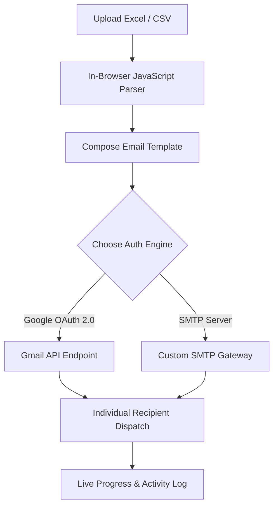

<div align="center">

  

  # MailFlow
  ### Modern, Browser-Based Bulk Email & Mail Merge Suite

  [](https://www.mailflow.tech)
  [](https://www.mailflow.tech/privacy)
  [](https://flask.palletsprojects.com/)
  [](https://www.mailflow.tech/privacy)

  [**Launch App**](https://www.mailflow.tech/app) &nbsp;•&nbsp; [**Privacy Policy**](https://www.mailflow.tech/privacy) &nbsp;•&nbsp; [**Terms of Service**](https://www.mailflow.tech/terms) &nbsp;•&nbsp; [**Support & FAQs**](https://www.mailflow.tech/support)

</div>

---

## Overview

**MailFlow** is a privacy-first, zero-subscription web application designed for entrepreneurs, marketers, and developers. Send personalized bulk email campaigns effortlessly using **Google OAuth 2.0** or **Custom SMTP** credentials directly from your browser.

### Key Capabilities

- **Zero Database Storage**: Contact lists, credentials, and attachments exist **only in your browser memory** and are discarded after sending.
- **Dynamic Mail Merge**: Variable substitution `{Name}`, `{Company}`, `{InvoiceNo}` parsed live in browser from Excel/CSV.
- **Dual Auth Engine**: Sign in with Google (OAuth 2.0 `gmail.send`) or any SMTP provider (Gmail, Outlook, Amazon SES, Brevo, SendGrid).
- **Smart Attachments**: Instant client-side Base64 streaming bypasses cloud file-system restrictions.
- **Zero-Timeout Architecture**: Asynchronous recipient dispatch avoids serverless execution limits (e.g. Vercel 10s timeout).

---

## System Architecture



---

## Feature Guide & Documentation

<details open>
<summary><b>Core Features & Capabilities</b></summary>
<br>

| Feature | Description | Status |
| :--- | :--- | :---: |
| **Google OAuth 2.0** | 1-Click login with official Google `gmail.send` scope | Supported |
| **Custom SMTP** | Gmail App Passwords, Outlook, Custom Domains, SES | Supported |
| **Excel & CSV Reader** | SheetJS browser parser (.xlsx, .xls, .csv) | Supported |
| **Dynamic Variables** | Dynamic chips `{Name}`, `{Role}`, `{CustomCol}` | Supported |
| **Attachment Engine** | File path mapping or browser drag-and-drop Base64 stream | Supported |
| **Campaign Control** | Real-time Pause, Resume, and Stop controls | Supported |
| **Dark & Light Mode** | Harmonized SaaS design system with `localStorage` state | Supported |
| **Mobile Optimized** | 100% responsive interface across desktop, tablet, and mobile | Supported |

</details>

<details>
<summary><b>Local Installation & Setup</b></summary>
<br>

### Prerequisites
- Python 3.9+
- Git

### 1. Clone & Install
```bash
git clone https://github.com/Satbir-Singh-42/MASS_EMAIL_PRO.git
cd MASS_EMAIL_PRO
pip install -r requirements.txt
```

### 2. Configure Environment (Optional for Google OAuth)
Create a `.env` file in the root directory:
```env
GOOGLE_CLIENT_ID=your_google_client_id
GOOGLE_CLIENT_SECRET=your_google_client_secret
SECRET_KEY=your_random_flask_secret_key
```

### 3. Run Application
```bash
python app.py
```
Visit `http://127.0.0.1:5001` in your browser.

</details>

<details>
<summary><b>Deploying to Vercel</b></summary>
<br>

This repository includes a pre-configured `vercel.json` manifest:

```json
{
  "version": 2,
  "builds": [{ "src": "app.py", "use": "@vercel/python" }],
  "routes": [{ "src": "/(.*)", "dest": "app.py" }]
}
```

1. Fork or push this repository to **GitHub**.
2. Connect your repository to [Vercel](https://vercel.com).
3. Set your `GOOGLE_CLIENT_ID` and `GOOGLE_CLIENT_SECRET` in **Environment Variables**.
4. Click **Deploy** — your app is live!

</details>

<details>
<summary><b>Spreadsheet Variable Format Example</b></summary>
<br>

Prepare your Excel or CSV spreadsheet with headers in row 1:

| Email | Name | Company | Amount | Attachment |
| :--- | :--- | :--- | :--- | :--- |
| alex@example.com | Alex Morgan | Acme Corp | $250 | invoice_101.pdf |
| sarah@example.com | Sarah Chen | Nexus Tech | $410 | invoice_102.pdf |

In your email body:
> Hi **{Name}**,
>
> Your monthly invoice for **{Company}** in the amount of **{Amount}** is attached.
>
> Best regards,  
> Sales Team

</details>

---

## Comparison Matrix

| Feature | MailFlow | Traditional Plugins | Paid SaaS (Mailchimp) |
| :--- | :---: | :---: | :---: |
| **Cost** | **$0 Forever** | Free/Paid | $20 - $300/mo |
| **Data Privacy** | **100% Client-Side** | Varies | Third-party Server |
| **Google OAuth** | **Native Built-in** | Rare | Excluded |
| **Setup Time** | **< 1 Minute** | Complex | Complex |
| **Custom Variables** | **Unlimited** | Limited | Tier-Restricted |

---

## Security & Privacy Commitments

MailFlow is designed under a **Zero-Knowledge Architecture**:
- **No Persistent Database**: User credentials and uploaded files are never written to disk or database tables.
- **Session Security**: Google OAuth access tokens are stored in encrypted, HTTP-only session cookies and cleared upon exit.
- **Compliance**: Built in strict adherence to the [Google API Services User Data Policy](https://developers.google.com/terms/api-services-user-data-policy).

---

## Contributing

Contributions are welcome!
1. Fork the Project
2. Create your Feature Branch (`git checkout -b feature/AmazingFeature`)
3. Commit your Changes (`git commit -m 'Add some AmazingFeature'`)
4. Push to the Branch (`git push origin feature/AmazingFeature`)
5. Open a Pull Request

---

## License & Legal

Distributed under the MIT License. See [`templates/terms.html`](templates/terms.html) and [`templates/privacy.html`](templates/privacy.html) for full legal guidelines.

<div align="center">
  <br>
  <sub>Built by Satbir Singh · MailFlow</sub>
</div>
